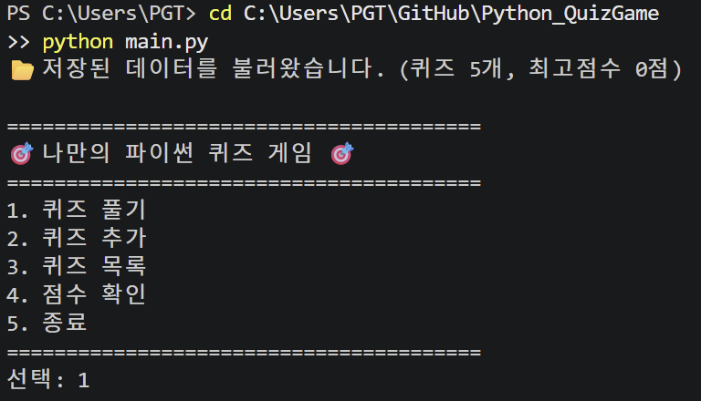
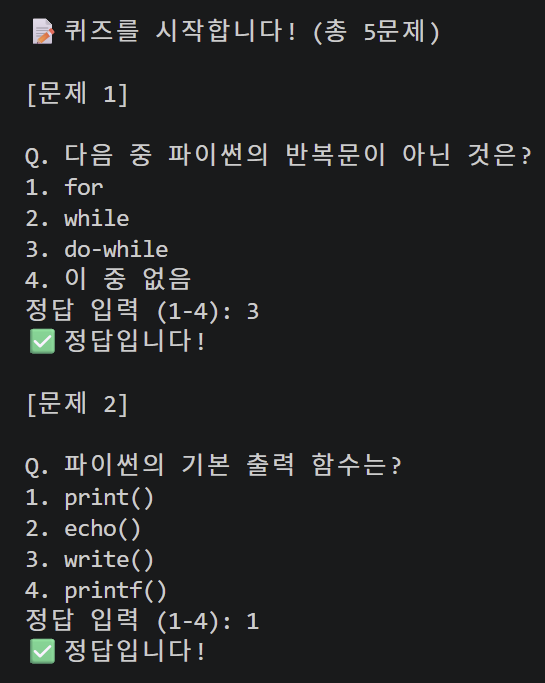
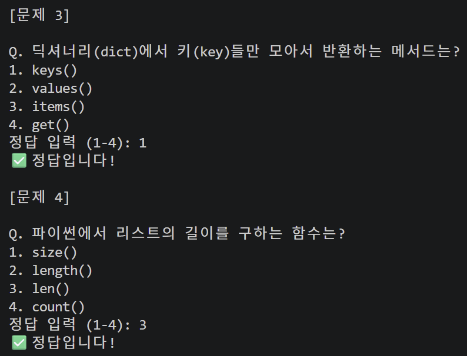
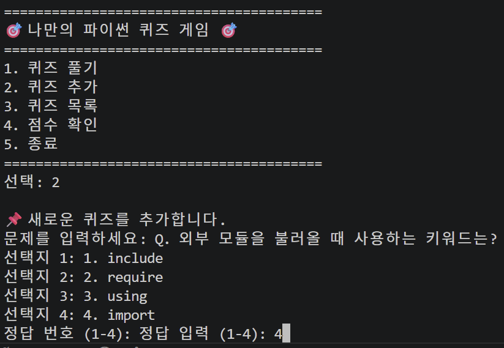
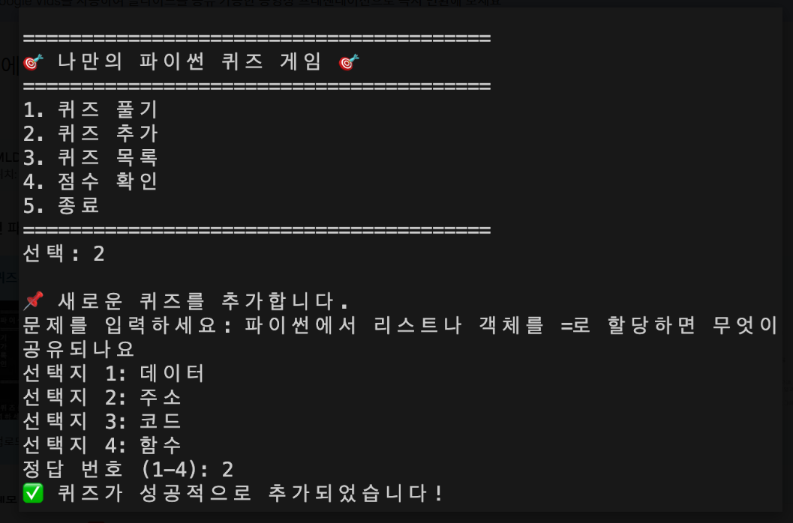
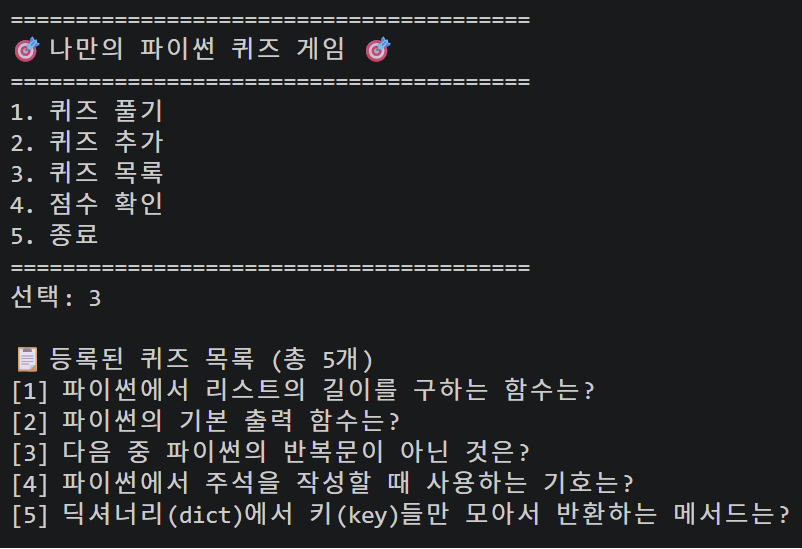
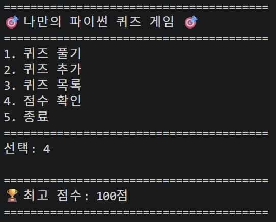
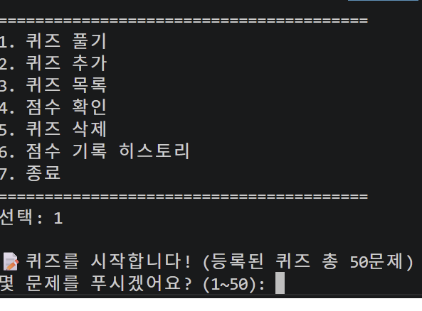
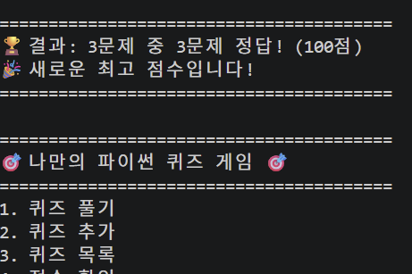

# 나만의 퀴즈 게임 (Python)

터미널에서 동작하는 콘솔 기반 퀴즈 게임. Python 기본 문법과 객체 지향(OOP)으로 구조화하고, JSON 파일로 데이터 영속성을 구현함.

## 목차

1. [프로젝트 개요](#1-프로젝트-개요)
2. [퀴즈 주제 선정 이유](#2-퀴즈-주제-선정-이유)
3. [실행 방법](#3-실행-방법)
4. [기능 목록](#4-기능-목록)
5. [코드 구조](#5-코드-구조)
6. [파일 구조](#6-파일-구조)
7. [데이터 파일 설명 (state.json)](#7-데이터-파일-설명-statejson)
8. [Git 워크플로우](#8-git-워크플로우)
9. [실행 결과 스크린샷](#9-실행-결과-스크린샷)
10. [구현 노트](#10-구현-노트)
11. [핵심 기술 원리](#11-핵심-기술-원리)
12. [확장성 및 장애 대응](#12-확장성-및-장애-대응)

---

## 1. 프로젝트 개요

Python 기본 문법(변수, 조건문, 반복문, 함수)과 객체 지향 프로그래밍(클래스)을 활용해 터미널에서 동작하는 퀴즈 게임을 처음부터 끝까지 구현한 프로젝트임. 문제 출제/정답 확인/점수 계산 흐름을 직접 만들고, JSON 파일 저장으로 프로그램을 종료해도 퀴즈와 점수가 유지되도록 데이터 영속성을 구현함. Git으로 기능 단위 커밋과 브랜치 병합까지 관리함.

## 2. 퀴즈 주제 선정 이유

**선정 주제: 파이썬(Python) 프로그래밍 기초**

파이썬 언어를 학습하면서 이 프로그램을 작성하고 있기 때문에, 스스로 배운 내용을 점검하고 복습하기 위해 파이썬 기초 문법(자료형, 반복문, 함수, 클래스, 예외 처리 등)과 관련된 퀴즈를 주제로 선정함.

## 3. 실행 방법

외부 라이브러리 없이 표준 라이브러리만 사용하며, Python 3.10 이상 환경에서 실행함.

```bash
# Windows
python main.py

# macOS / Linux
python3 main.py
```

실행 전 아래 명령으로 Python 버전을 확인함.

```bash
python3 --version
```

**Python 버전 관련 참고**: 미션 권장 환경은 3.10 이상이나, 실제 실행·제출 환경(공용 PC)은 관리자 권한 제한(`brew install` 시 `/usr/local/Cellar is not writable` 오류 발생)으로 버전 업그레이드가 불가능해 **Python 3.9.6**에서 실행함. 코드에서 `match` 문, `int | None` 같은 3.10 전용 문법을 전혀 사용하지 않고 표준 `if/elif`, 예외 처리, 클래스 문법만 사용했기 때문에 3.9에서도 모든 기능이 동일하게 동작함을 확인함.

## 4. 기능 목록

| 번호 | 기능 | 설명 |
| --- | --- | --- |
| 1 | 퀴즈 풀기 | 몇 문제를 풀지 직접 선택한 뒤, 등록된 퀴즈 중 해당 개수만큼 랜덤한 순서로 출제하고 채점 후 결과를 표시함 |
| 2 | 퀴즈 추가 | 문제/선택지 4개/정답 번호를 입력받아 새 퀴즈를 등록하고 즉시 파일에 저장함 |
| 3 | 퀴즈 목록 | 등록된 전체 퀴즈 목록을 번호와 함께 출력함 |
| 4 | 점수 확인 | 지금까지 달성한 최고 점수를 확인함 |
| 5 | 점수 기록 히스토리 | 지금까지 플레이한 모든 게임 기록(날짜/시간, 문제 수, 정답 수, 점수)을 목록으로 확인함 |
| 6 | 종료 | 데이터를 저장한 뒤 안전하게 종료함 |

기본 제공 퀴즈는 파이썬 기초 주제로 **총 50개**(미션 요구 최소 5개를 크게 상회) 등록되어 있으며, `state.json`에 저장되어 있어 `퀴즈 목록`에서 바로 개수 확인 가능함.

**보너스 구현 (5개 중 3개 구현)**
1. **랜덤 출제** — 퀴즈 풀기 시 매번 문제 순서를 `random.shuffle`로 랜덤하게 섞어 출제함
2. **문제 수 선택** — 풀기 시작 전 "몇 문제를 푸시겠어요?"로 개수를 직접 선택함(등록된 퀴즈 수 이하로 검증)
3. **점수 기록 히스토리** — 최고 점수와 별개로 매 게임마다 날짜·시간·문제 수·정답 수·점수를 `history` 배열에 누적 저장하고, 메뉴 5번에서 전체 기록을 확인함

(힌트 기능, 퀴즈 삭제 기능은 구현했다가 범위를 좁혀 제외함)

## 5. 코드 구조

- **`Quiz` 클래스** — 퀴즈 1개(문제, 선택지, 정답)를 표현. `display()`(출력), `check_answer()`(정답 확인), `to_dict()`/`from_dict()`(JSON 직렬화·역직렬화) 메서드를 가짐.
- **`QuizGame` 클래스** — 게임 전체를 관리. 퀴즈 목록·최고 점수·게임 기록 히스토리를 속성으로 가지며, 메뉴 표시(`display_menu`)·입력 처리(`get_input`)·게임 진행(`run`, `play_quiz`, `add_quiz`, `list_quizzes`, `show_score`, `show_history`)·파일 저장/불러오기(`save_data`, `load_data`)로 메서드를 기능별로 분리함.

**책임 분리 기준**: "바뀌는 이유가 다르면 메서드도 다르게 나눈다"는 기준으로 나눔.
- **입력 처리(검증)** — `get_input()` 한 곳에서 공백 제거·빈 입력·숫자 변환 실패·허용 범위 밖 입력을 모두 처리함. 메뉴 선택이든 정답 입력이든 항상 이 메서드를 거치게 해서, 검증 규칙이 바뀌어도 `get_input()` 한 곳만 고치면 됨.
- **게임 진행** — `play_quiz`/`add_quiz`/`list_quizzes`/`show_score`/`show_history`로 메뉴 항목 하나당 메서드 하나씩 대응시켜, 어떤 기능을 고쳐야 할 때 해당 메서드만 보면 되도록 함.
- **데이터 저장/불러오기** — `save_data`/`load_data`로 파일 I/O만 전담시켜, 게임 로직 코드에 `open()`/`json.dump()` 같은 파일 처리 코드가 섞이지 않게 함.

**`state.json` 읽기/쓰기 흐름**: 읽기는 `QuizGame.__init__()` → `load_data()`에서 프로그램 시작 시 딱 1번 발생함. 쓰기(`save_data()`)는 데이터가 실제로 바뀌는 세 시점에 호출됨 — ① `play_quiz()`에서 게임을 한 판 마칠 때마다(히스토리 기록을 위해 최고 점수 갱신 여부와 무관하게 매번), ② `add_quiz()`로 새 퀴즈를 등록했을 때, ③ `run()`에서 메뉴 종료 또는 `Ctrl+C`/`EOF`로 빠져나갈 때. "바뀔 때마다 바로 저장"하는 방식이라 프로그램이 예기치 않게 죽어도 마지막 변경 이전 데이터는 항상 안전함.

**Ctrl+C·EOF 안전 종료**: `run()`의 메인 루프, `play_quiz()`의 문제 풀이 루프, `add_quiz()`의 입력 구간을 각각 `try/except (KeyboardInterrupt, EOFError)`로 감싸서, 사용자가 `Ctrl+C`를 누르거나 입력 스트림이 끊겨도 프로그램이 그냥 죽지 않고 `save_data()`를 호출한 뒤 안전하게 종료하도록 함.

## 6. 파일 구조

```
Python_QuizGame/
├── main.py                  # 프로그램 진입점 (Quiz, QuizGame 클래스)
├── state.json                # 퀴즈 데이터 및 최고 점수 저장 파일
├── .gitignore                 # Git에서 제외할 파일 목록
├── README.md                 # 프로젝트 설명 문서
└── docs/
    └── screenshots/           # 실행 결과·Git 로그 스크린샷
```

## 7. 데이터 파일 설명 (`state.json`)

- **경로**: 프로젝트 루트 (`Python_QuizGame/state.json`)
- **역할**: 사용자가 추가한 퀴즈 데이터와 최고 점수를 저장해, 프로그램을 종료했다가 다시 실행해도 유지되도록 함(데이터 영속성). 파일이 없으면 기본 퀴즈 데이터를 사용하고, 손상된 경우 `try/except`로 감지해 기본 데이터로 복구함.
- **인코딩**: UTF-8
- **필드 구조 (스키마)**:
  ```json
  {
      "best_score": 60,
      "quizzes": [
          {
              "question": "파이썬에서 리스트의 길이를 구하는 함수는?",
              "choices": ["size()", "length()", "len()", "count()"],
              "answer": 3
          }
      ],
      "history": [
          {
              "date": "2026-08-06 01:02",
              "total": 5,
              "score": 4,
              "percentage": 80
          }
      ]
  }
  ```
  - `best_score`: 지금까지 달성한 최고 점수(정수)
  - `quizzes`: 퀴즈 목록. 각 항목은 `question`(문제), `choices`(선택지 4개 배열), `answer`(정답 번호, 1~4) 필드로 구성됨
  - `history`: 지금까지 플레이한 모든 게임 기록 배열. 각 항목은 `date`(플레이 일시), `total`(푼 문제 수), `score`(정답 문제 수), `percentage`(환산 점수) 필드로 구성됨

## 8. Git 워크플로우

- **커밋 컨벤션**: `Feat:`(기능 추가), `Fix:`(버그 수정), `Docs:`(문서) 접두사로 변경 내용을 드러내는 커밋 메시지를 작성함
- **커밋 단위 기준**: 기능 하나가 "동작 가능한 상태"로 완성될 때마다 커밋함(예: Quiz 클래스 생성 → 기본 퀴즈 데이터 추가 → 저장/불러오기 → 메뉴 UI → 퀴즈 추가/목록 → 퀴즈 풀기 → 점수). 버그 수정은 기능 커밋과 섞지 않고 `Fix:` 커밋으로 따로 분리해, 하나의 커밋이 "무엇을 위해 추가된 것인지" 또는 "무엇을 고친 것인지" 하나의 의미만 갖도록 함.
- **브랜치 분리 이유**: 퀴즈 풀기·점수 기능은 기존 메뉴/추가/목록 기능과 독립적으로 개발 가능한 단위였기 때문에, `master`를 항상 안정된 상태로 유지하면서 `feature/play-quiz` 브랜치에서 별도로 개발함. 개발 중인 기능이 미완성이어도 `master` 이력에는 영향을 주지 않기 위함.
- **병합(merge)의 의미**: 분리해서 진행한 브랜치의 커밋 이력을 다시 하나로 합치는 작업. 이번 병합은 `master`가 분기 이후 다른 변경이 없었기 때문에 **Fast-forward**로 처리됨 — 별도의 병합 커밋을 만들지 않고 `master` 포인터를 `feature/play-quiz`가 가리키던 커밋으로 그대로 옮김. [9번 스크린샷](#9-실행-결과-스크린샷)의 `git log --oneline --graph` 결과에서 `(feature/play-quiz)` 라벨이 붙은 커밋이 바로 그 병합 지점임(Fast-forward라 별도 "Merge" 커밋 줄은 없고, 브랜치 라벨이 같은 한 줄에 나란히 붙는 것으로 확인됨).
  ```bash
  git checkout -b feature/play-quiz
  # 퀴즈 풀기 / 점수 기능 개발 및 커밋
  git checkout master
  git merge feature/play-quiz
  ```
- **클론(clone)과 원격 동기화(pull) 실습**: `clone`은 원격 저장소 전체를 로컬에 새로 복사해오는 명령이고, `pull`은 이미 로컬에 있는 저장소에 원격의 최신 변경 사항만 받아와 반영하는 명령임 — 이 차이를 직접 확인하기 위해 별도 폴더에 저장소를 새로 내려받고, 원본 작업 폴더에서 커밋·푸시한 변경 사항을 그 복사본에서 `pull`로 받아오는 과정을 실습함.
  ```bash
  # 별도 위치에 저장소를 새로 내려받음
  git clone https://github.com/SeouliteParker/Python_QuizGame.git

  # 원본 작업 폴더에서 수정 → 커밋 → 푸시 후, 다른 로컬 복사본에서 반영
  git pull origin master
  ```
  실제로 `git pull` 실행 결과 `8cbf1d3..d1da824 master -> origin/master`로 Fast-forward 갱신되며 원격에만 있던 커밋(퀴즈 추가 완료 화면 스크린샷)이 로컬로 반영됨을 확인함.
- **사용한 Git 명령어**: `init`, `add`, `commit`, `push`, `checkout`(브랜치 생성·전환), `merge`, `clone`, `pull`

## 9. 실행 결과 스크린샷

**프로그램 실행 및 메인 메뉴**



**퀴즈 풀기**




**퀴즈 추가**




**퀴즈 목록**



**점수 확인**



**보너스 - 문제 수 선택**



**보너스 - 점수 기록 히스토리**



**Git 커밋 이력 (`git log --oneline --graph`)**


## 10. 구현 노트

- **Windows 콘솔 인코딩 문제**: 이모지(🎯, ✅ 등)를 출력할 때 Windows 콘솔 기본 인코딩(cp949)에서 오류가 발생해, `sys.stdout.reconfigure(encoding='utf-8')`로 표준 출력 인코딩을 UTF-8로 고정해 해결함
- **데이터 손상 대응**: `state.json`이 없거나(`FileNotFoundError` 상황) JSON 파싱에 실패하면(`json.JSONDecodeError`) 기본 퀴즈 5개로 복구하여, 파일 문제로 프로그램이 죽지 않도록 함
- **비정상 종료 대응**: 메뉴 대기 중이나 퀴즈 풀이 중 `Ctrl+C`(`KeyboardInterrupt`) 또는 입력 스트림 종료(`EOFError`)가 발생해도 현재까지 데이터를 저장한 뒤 안전하게 종료함

## 11. 핵심 기술 원리

**클래스를 사용한 이유**: 퀴즈 데이터(문제·선택지·정답)와 그 데이터를 다루는 동작(출력, 정답 확인)을 하나의 단위로 묶기 위함. 함수만으로 구현하면 퀴즈를 딕셔너리나 여러 변수로 관리하고 정답 확인 함수에 매번 "어떤 퀴즈인지"를 인자로 넘겨야 해서 데이터와 로직이 흩어짐. 클래스를 쓰면 `quiz.check_answer(4)`처럼 퀴즈 스스로 정답을 판단하게 할 수 있어 코드가 명확해지고, 퀴즈가 늘어나도 `Quiz` 인스턴스를 리스트에 추가하기만 하면 자연스럽게 확장됨.

**JSON으로 저장한 이유와 특징**: JSON은 파이썬의 `dict`/`list`와 거의 1:1로 대응돼서 `json.dump`/`json.load`만으로 변환 없이 저장·복원할 수 있음. 텍스트 기반이라 사람이 직접 열어 내용을 확인·수정하기 쉽고, 표준 라이브러리(`json` 모듈)만으로 처리 가능해 외부 라이브러리가 필요 없음 — 이 미션의 "외부 라이브러리 없이 구현" 제약과도 맞음.

**`try/except`가 필요한 이유**: 파일 입출력은 프로그램이 통제할 수 없는 외부 요인으로 실패할 수 있음 — 파일이 아예 없는 경우(첫 실행), 사용자가 `state.json`을 직접 열어 수정하다 JSON 형식이 깨진 경우, 디스크 쓰기 권한이 없거나 저장 도중 실패하는 경우 등. 이 프로젝트에서는 `load_data()`에서 `json.JSONDecodeError`(형식이 깨진 경우)와 `IOError`(파일을 못 여는 경우)를 잡아 기본 퀴즈로 복구하고, `save_data()`에서도 `IOError`를 잡아 저장 실패 시 에러 메시지만 출력하고 프로그램은 계속 실행되게 함.

**`state.json` 데이터 구조를 이렇게 설계한 이유**: 이 프로그램이 다루는 데이터는 "퀴즈 목록", "최고 점수", "게임 기록 히스토리" 세 종류라, `quizzes`·`best_score`·`history`를 최상위에 나란히 두는 것 이상으로 중첩을 깊게 만들 필요가 없었음. `quizzes` 배열의 각 원소는 `Quiz.to_dict()`/`Quiz.from_dict()`와 1:1로 대응되도록 설계해, `Quiz` 클래스의 속성이 늘어나면 `to_dict`/`from_dict`만 고치면 JSON 구조도 자연스럽게 따라가도록 함. `history`는 게임 1판 = 배열 원소 1개로 대응시켜, 최고 점수처럼 "덮어쓰는" 값이 아니라 "쌓이는" 값이라는 성격 차이를 배열이라는 자료구조로 자연스럽게 표현함.

## 12. 확장성 및 장애 대응

**퀴즈가 1000개 이상으로 늘어난다면?**: 현재 `save_data()`는 매번 `quizzes` 전체 리스트를 통째로 직렬화해 파일 전체를 덮어씀. 퀴즈가 많아지면 ① 퀴즈 하나만 추가해도 매번 파일 전체를 다시 쓰게 되어 저장 시간이 늘어나고, ② 프로그램 시작 시 전체를 한 번에 메모리로 읽어들이는 구조라 메모리 사용량도 함께 늘어나며, ③ JSON은 "퀴즈 하나만 수정"하는 부분 갱신이 불가능해 항상 전체를 읽고 고치고 다시 쓰는 방식이 됨. 이 정도 규모라면 SQLite 같은 경량 DB로 옮겨 필요한 레코드만 읽고 쓰는 방식이 더 적합함.

**`state.json`이 손상되어 파싱에 실패한다면?**: 현재 코드는 `json.JSONDecodeError` 발생 시 기본 퀴즈 5개로 초기화하는 방식으로만 대응함(`load_data()`) — 프로그램이 죽지 않는 것은 보장하지만, 손상 직전까지 쌓아둔 사용자 데이터는 복구하지 못함. 데이터를 잃지 않으려면 ① 저장할 때마다 기존 파일을 `state.json.bak`으로 함께 남겨두고 손상 시 백업에서 복구하거나, ② 손상된 파일을 곧바로 기본값으로 덮어쓰지 않고 `state.json.corrupted`처럼 이름을 바꿔 보존해 사용자가 나중에 직접 복구를 시도할 수 있게 하는 방법이 있음. 지금 구현은 "계속 실행되는 것"까지만 보장하고 "복구"까지는 안 되어 있어, 실제로 개선이 필요한 지점으로 남겨둠.

**채점 방식이나 퀴즈 구조(선택지 개수 등) 요구사항이 바뀐다면?**: 정답 채점 로직은 `Quiz.check_answer()` 한 곳에만 있어서, 예를 들어 "부분 점수"를 주는 방식으로 바뀌면 이 메서드만 고치면 됨. 선택지 개수(현재 4개 고정)를 바꾸려면 `add_quiz()`의 `for i in range(4)` 부분과, 정답 번호 유효 범위를 검사하는 `get_input(..., range(1, 5))` 호출 두 곳을 함께 고쳐야 함. `Quiz` 클래스 자체는 `choices`를 리스트로만 다룰 뿐 개수에 의존하지 않으므로 `Quiz` 클래스는 그대로 두어도 됨.
